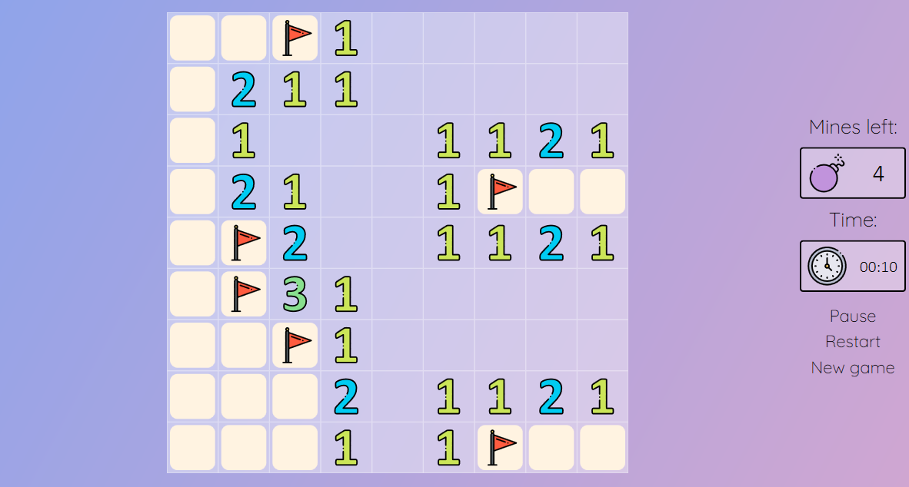
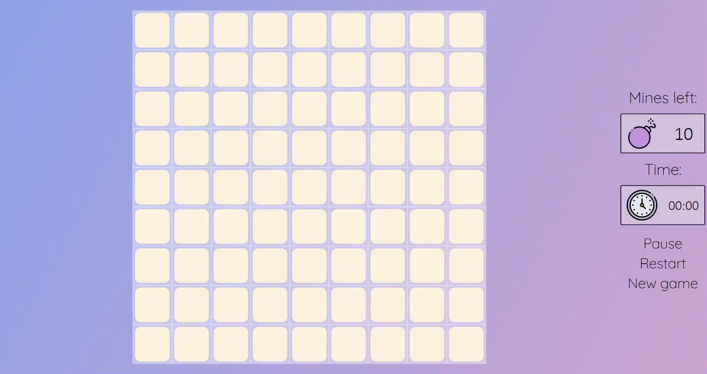
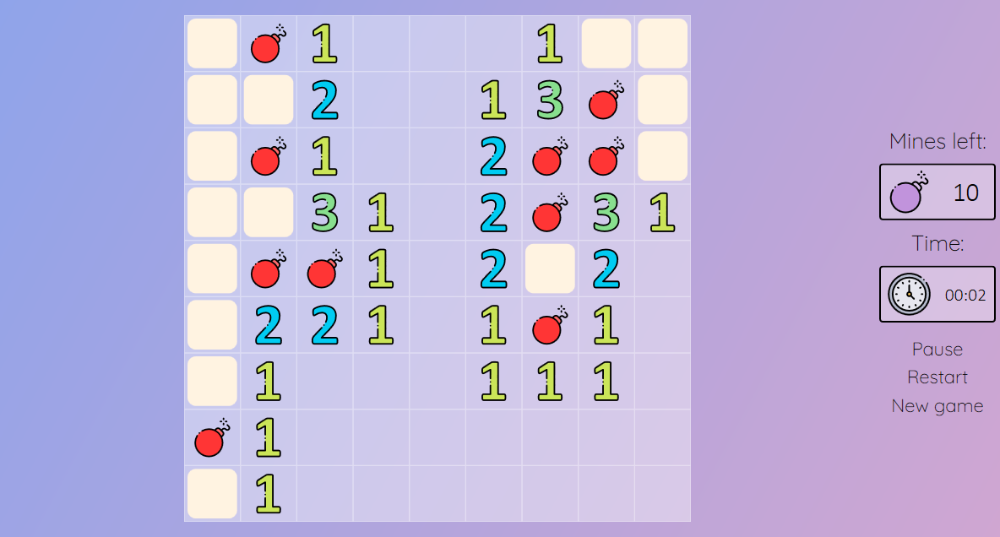
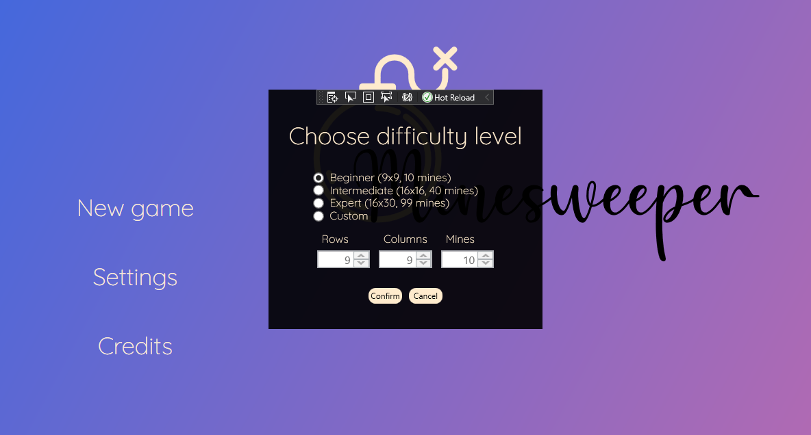
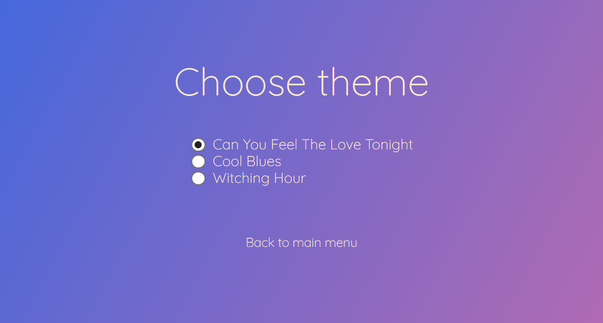

  

# About

Minesweeper is a single-player puzzle game. 

 

The main goal of the game is to clear a board of mines without detonating any of them. As in the original version, you can left-click a cell to uncover it, right-click to mark the bomb or double-click to uncover adjacent cells.

Watch out for the mines - if you hit one, you lose.

# Difficulty Levels

You can start the game by choosing one of three predefined difficulty levels or creating your custom one!

# Themes

There are 3 available themes.

# Credits

Icons made by [Freepik](https://www.flaticon.com/authors/freepik) from [www.flaticon.com](https://www.flaticon.com/)
